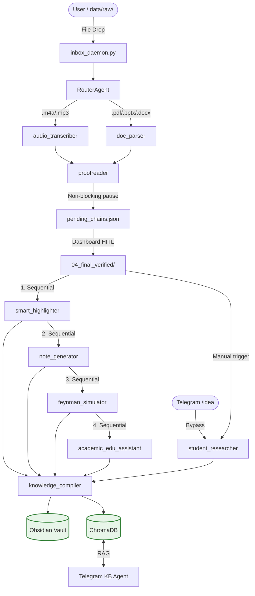

# local-workspace — Open Claw Ecosystem

> An Event-driven, Human-in-the-Loop (HITL), Multi-Agent Orchestration Framework for local-first AI automation on macOS Apple Silicon.

## Architecture Overview



## Structure

```
local-workspace/
├── openclaw-sandbox/   ← Open Claw AI automation (13-skill pipeline ecosystem)
├── infra/               ← LiteLLM proxy, Open WebUI, Pipelines, lifecycle scripts
├── docs/                ← Global documentation SSoT (ARCHITECTURE, USER_MANUAL, CODING_GUIDELINES)
├── memory/              ← Global AI memory (DECISIONS, HANDOFF, TASKS)
├── ops/                 ← Global quality gate (check.sh)
└── tests/               ← E2E and integration test stubs
```

## Quick Start

1. **Clone:**
   ```bash
   git clone <your-repo-url> local-workspace
   cd local-workspace
   ```

2. **Configure environment:**
   ```bash
   cp .env.example .env
   # Set TELEGRAM_BOT_TOKEN, TELEGRAM_CHAT_ID
   ```

3. **Install dependencies (uv):**
   ```bash
   cd openclaw-sandbox
   uv sync
   ```

4. **Start all services:**
   ```bash
   cd ..
   ./infra/scripts/start.sh
   ```

5. **Drop files into the universal inbox:**
   ```bash
   cp lecture.m4a  openclaw-sandbox/data/raw/YourSubject/
   cp textbook.pdf openclaw-sandbox/data/raw/YourSubject/
   ```

6. **When Telegram notifies you**, open `http://localhost:5000` to approve the proofread output.

7. **For academic research** (manually triggered):
   ```bash
   cd openclaw-sandbox
   uv run skills/student_researcher/scripts/run_all.py --process-all
   ```

## Service Endpoints

| Service | URL |
|---|---|
| Open WebUI | http://127.0.0.1:3000 |
| LiteLLM Proxy | http://127.0.0.1:4000 |
| Ollama | http://127.0.0.1:11434 |
| Pipelines | http://127.0.0.1:9099 |
| HITL Dashboard | http://127.0.0.1:5000 |
| Open Claw API | http://127.0.0.1:18789 |

## Documentation

| Document | Purpose |
|---|---|
| `docs/USER_MANUAL.md` | Complete V9.17 usage guide — **start here** |
| `docs/ARCHITECTURE.md` | Global system architecture & design decisions |
| `docs/CODING_GUIDELINES.md` | Engineering standards **v4.2.0** — SSoT for all rules |
| `openclaw-sandbox/docs/ARCHITECTURE.md` | V9.17 Sequential SSoT pipeline canonical reference |
| `memory/DECISIONS.md` | Architectural Decision Records (ADR-001 → ADR-018) |
| `openclaw-sandbox/AGENTS.md` | Internal skill agent registry |

## Change Discipline

Any code change must be accompanied by documentation updates in the same commit. See `CONTRIBUTING.md`.
Run `./ops/check.sh` before every commit to validate Ruff lint, Ruff format, and Mypy.
