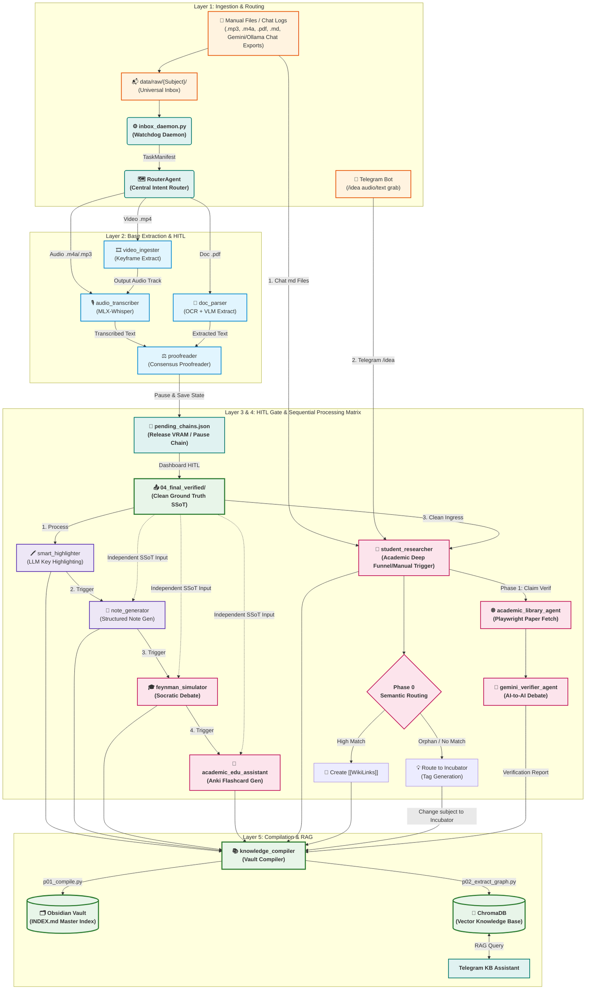

# ARCHITECTURE.md — Global System Architecture

> **Scope:** Entire `local-workspace/` monorepo
> **Last Updated:** 2026-05-23
> **Audience:** All AI agents and developers operating in this workspace

---

## System Overview

`local-workspace/` is a private monorepo that hosts a local AI automation ecosystem on macOS (16 GB RAM, Apple Silicon). It orchestrates several infrastructure services and one primary application sandbox.

```
local-workspace/                    ← Monorepo root (git repo)
│
├── openclaw-sandbox/              ← Primary App: Open Claw AI Automation
│   ├── core/                       ← Shared Python framework (sub-packages below)
│   │   ├── ai/                     ← LLM clients, RAG, vector DB
│   │   ├── cli/                    ← Terminal UI/UX, config wizards, arg parsing
│   │   ├── config/                 ← YAML config managers and validators
│   │   ├── orchestration/          ← RouterAgent, PipelineBase, TaskQueue, EventBus
│   │   ├── services/               ← Background daemons: inbox_daemon, telegram_bot, hitl_manager
│   │   ├── state/                  ← StateManager, ResumeManager, SessionState
│   │   └── utils/                  ← AtomicWriter, PathBuilder, log_manager, bootstrap
│   ├── skills/                     ← 9-skill AI pipeline ecosystem
│   ├── ops/                        ← Sandbox quality gate (check.sh, bootstrap.sh)
│   └── tests/                      ← Unit & integration tests (pytest)
│
├── infra/                          ← Infrastructure layer (LLM services, UI, proxy)
│   ├── litellm/                    ← LiteLLM OpenAI-compatible proxy (port 4000)
│   ├── open-webui/                 ← Open WebUI chat interface (port 3000)
│   ├── pipelines/                  ← Open WebUI Pipeline runner (port 9099)
│   └── scripts/                    ← Lifecycle scripts: start.sh, stop.sh, watchdog.sh
│
├── docs/                           ← Global documentation (SSoT)
│   ├── INDEX.md                    ← Master navigation index for AI agents and humans
│   ├── USER_MANUAL.md              ← End-user operational guide
│   ├── CODING_GUIDELINES.md  ← Engineering standards (v4.2.0)
│   └── STRUCTURE.md                ← Monorepo directory structure reference
│
├── memory/                         ← Global AI memory (this directory)
│   ├── ARCHITECTURE.md             ← This file — single source of truth
│   ├── DECISIONS.md                ← Global architectural decision log (ADR format)
│   ├── HANDOFF.md                  ← Session handoff records
│   ├── PROJECT_RULES.md                   ← AI agent collaboration context
│   └── TASKS.md                    ← Active task tracking
│
└── ops/                            ← Global quality gate scripts
    ├── check.sh                    ← Full monorepo quality gate
    └── generate_tree.py            ← Workspace tree generator utility
```

---

## Design Decisions

### Why `openclaw-sandbox/` is NOT inside `apps/`

1. It is the **only** application in this monorepo (no sibling apps).
2. It contains its own mature internal structure (`core/`, `skills/`, `ops/`, `tests/`).
3. Adding an `apps/` wrapper adds indirection with no benefit at this scale.
4. `WORKSPACE_DIR` environment variables already point directly to the sandbox.

**If a second application is added in the future**, create `apps/` and move both into it at that time.

### Why `pipelines/` is in `infra/` (not `apps/`)

Open WebUI Pipelines is infrastructure (a plugin runner for the LLM proxy), not an application with user-facing logic. It belongs with the other infrastructure services in `infra/`.

### Strict Extraction vs Processing Boundaries

Skills are strictly divided into **Extraction** and **Processing** layers:

1. **Ingestion (`inbox_daemon.py`)**: Watches `data/raw/` for stabilized files.
2. **Routing (`router_agent.py`)**: Resolves file intent to a skill chain (e.g., `audio_transcriber -> note_generator`) and moves the file to the initial skill's input directory.
3. **Execution (`task_queue.py`)**: Enqueues the first skill as an isolated subprocess. Upon success (exit code 0), emits a `PipelineCompleted` event carrying the remaining chain.
4. **Handoff (`router_agent.py`)**: Subscribes to `PipelineCompleted`, pops the finished skill from the chain, resolves the input/output paths, and enqueues the next skill automatically.
5. **GIGO Prevention**: Each phase enforces strict checkpoints, VAD/Hallucination guards, and Verification Gates (HITL).

### `core/` Sub-Package Refactoring (2026-05-01)

The `core/` directory was refactored from a flat module into domain-specific sub-packages to enforce high cohesion and single responsibility. **All imports must use the full sub-package path:**

| Old (broken) | New (correct) |
|---|---|
| `from core.atomic_writer import AtomicWriter` | `from core.utils.atomic_writer import AtomicWriter` |
| `from core.pipeline_base import PipelineBase` | `from core.orchestration.pipeline_base import PipelineBase` |
| `from core.state_manager import StateManager` | `from core.state.state_manager import StateManager` |
| `from core.llm_client import OllamaClient` | `from core.ai.llm_client import OllamaClient` |
| `from core.inbox_daemon import SystemInboxDaemon` | `from core.services.inbox_daemon import SystemInboxDaemon` |

---

## Service Map

| Service | Port | Directory | Started by |
|---|---|---|---|
| Ollama (LLM) | 11434 | system install | `infra/scripts/start.sh` |
| LiteLLM Proxy | 4000 | `infra/litellm/` | `infra/scripts/start.sh` |
| Open WebUI | 3000 | `infra/open-webui/` | `infra/scripts/start.sh` |
| Pipelines | 9099 | `infra/pipelines/` | `infra/scripts/start.sh` |
| Inbox Daemon | — | `openclaw-sandbox/core/services/inbox_daemon.py` | `infra/scripts/start.sh` |
| RAM Watchdog | — | `infra/scripts/watchdog.sh` | `infra/scripts/start.sh` |
| Scheduler | — | `openclaw-sandbox/core/services/scheduler.py` | `infra/scripts/start.sh` |

---

## AI Agent Entry Points

| Agent starting point | When to use |
|---|---|
| `memory/ARCHITECTURE.md` (this file) | Understanding the entire monorepo |
| `docs/INDEX.md` | Navigating to any skill or global doc |
| `openclaw-sandbox/AGENTS.md` | Sandbox rules and behaviour contract |
| `docs/CODING_GUIDELINES.md` | Engineering development standards |

---

## Core Framework (`core/`) Sub-Module Reference

| Sub-package | Module | Responsibility |
|---|---|---|
| `core/orchestration/` | `pipeline_base.py` | Abstract base class for all skill phases |
| `core/orchestration/` | `task_queue.py` | Single-threaded queue handling subprocess execution. Emits `PipelineCompleted` upon successful task completion. DLQ quarantine |
| `core/orchestration/` | `run_all_pipelines.py` | PID-locked global pipeline orchestrator |
| `core/orchestration/` | `router_agent.py` | Routes incoming files and manages skill chains (Intents). Subscribes to `PipelineCompleted` to trigger subsequent skills in a multi-skill pipeline via TaskQueue. |
| `core/orchestration/` | `event_bus.py` | In-process Pub/Sub for decoupling components. |
| `core/orchestration/` | `human_gate.py` | **Ephemeral WebUI Verification Gate** — pauses pipeline for human-in-the-loop review; side-by-side Ollama diff with click-to-play audio timestamps |
| `core/state/` | `state_manager.py` | Per-file per-phase state persistence (atomic JSON) |
| `core/state/` | `resume_manager.py` | Mid-run checkpoint save and restore |
| `core/state/` | `session_state.py` | Volatile per-session state |
| `core/utils/` | `atomic_writer.py` | Crash-safe file writes via `tempfile + os.replace()` |
| `core/utils/` | `path_builder.py` | Canonical data path resolution from `WORKSPACE_DIR` |
| `core/utils/` | `log_manager.py` | Structured logger factory with JSON mode |
| `core/utils/` | `bootstrap.py` | Locates `core/` and inserts into `sys.path` (idempotent) |
| `core/utils/` | `diff_engine.py` | Audit diff generation for content integrity checks |
| `core/utils/` | `error_classifier.py` | Exception classification (recoverable / fatal / user-error) |
| `core/ai/` | `llm_client.py` | Ollama/LM Studio client with exponential-backoff retry and `SqliteSemanticCache` (`data/llm_cache.sqlite3`, SHA-256 keyed, `temperature=0` only) |
| `core/ai/` | `hybrid_retriever.py` | RAG retrieval combining vector + keyword search |
| `core/ai/` | `graph_store.py` | Knowledge graph persistence and query |
| `core/config/` | `config_manager.py` | YAML config loading with environment override |
| `core/config/` | `config_validation.py` | Pydantic-based config schema validation |
| `core/cli/` | `cli.py` | Shared `argparse` factory for all skills |
| `core/cli/` | `cli_runner.py` | Subprocess command builders for all skills |
| `core/services/` | `inbox_daemon.py` | Watchdog daemon for universal inbox monitoring |
| `core/services/` | `security_manager.py` | PDF sanitisation and path-traversal prevention |
| `core/services/` | `telegram_bot.py` | Telegram bot long-polling daemon |

---

## Skill Ecosystem & Dual-Track 5-Layer Workflow

OpenClaw V9.16 implements a robust **Dual-Track 5-Layer Workflow** that organizes modular skills into a cohesive knowledge pipeline. It supports both rapid ingestion (Track A) and deep research/Socratic inner loops (Track B).

### 🏛️ Dual-Track Architecture Map



### 🛣️ Dynamic Routing Protocols & Sequential Cognitive Chain

1. **The Sequential Shared-SSoT Cognitive Chain (Layer 3 & 4)**:
   - Designed to run on Apple Silicon 16 GB memory constraints without causing VRAM concurrent exhaustion (OOM), while maintaining the highest quality standards.
   - **Pipeline Flow**: After passing the Layer 2 `proofreader` and obtaining human validation, the remaining cognitive phases are executed sequentially: `smart_highlighter` ➔ `note_generator` ➔ `feynman_simulator` ➔ `academic_edu_assistant`.
   - **Shared-SSoT Principle**: Crucially, each phase independently reads and processes the same verified ground truth (`04_final_verified/`) as its identical base context. No module consumes the output of a preceding LLM phase (strictly preventing cascading formatting pollution and hallucination accumulation).

2. **The Deep Research & Academic Funnel (`student_researcher`)**:
   - Designed for highly complex academic synthesis, claim verification, and active inspiration incubation.
   - **Multi-Ingress Funnel**: Unifies inputs from three distinct sources without linear constraints:
     1. **Chat-related Markdown files** manually placed in `data/raw/`.
     2. **Telegram `/idea` inputs** captured remotely by the Telegram bot.
     3. **Clean, verified outputs from the `proofreader`** (after HITL verification in Layer 2).
   - **Strict Manual Trigger Gating**: Because the user uses shorthand, bullet notes, and remote chat logs which require deep validation at the desktop, `student_researcher` inputs are staged in its ingress directories. The execution of this deep research pipeline is **strictly manually triggered** by the user when they return to the computer, safeguarding local VRAM and cloud API token quotas.
   - **Workflow**: Claims are parsed, verified against academic databases via persistent Playwright instances (`academic_library_agent`), debated in CoT between cloud-Gemini and local-DeepSeek (`gemini_verifier_agent`), and compiled back into Layer 5.

---

## 🏃‍♂️ OpenClaw 5-Layer Workflow Detailed Inner Operations

To ensure absolute reliability, SSoT, and Traceability, every layer in OpenClaw operates under strict programmatic rules, context-aware guards, and fail-safe designs.

### Layer 1: Ingestion & Smart Dispatching (Universal Ingress Gate)
- **`inbox_daemon.py` Watchdog**: A background thread utilizing Python's `watchdog` library to actively scan the `data/raw/{Subject}/` directories. 
  - **Stable-State Verification Heuristics**: To prevent partial processing or parsing crashes on incomplete files (e.g. while a large lecture recording or deep PDF is still downloading or copying), the daemon tracks file sizes and modification times. It only registers a file when its size remains identical for 3 consecutive check intervals (default: 5 seconds).
  - **Metadata Manifest Packaging**: Once stabilized, the daemon generates a unique UUID for the ingestion event and packs it into a `TaskManifest` containing source path, subject, creation timestamp, and auto-computed hash.
- **`RouterAgent` Dynamic Routing Table**: 
  - **Auto-Routing Engine**: The agent reads the user-configured `inbox_config.json` rules at initialization. Based on the file extension, it dynamically routes the file to the starting skill (e.g., `.m4a` to `audio_transcriber`, `.pdf` to `doc_parser`).
  - **Context-Aware Model Tuning**: Before queuing the task, the `RouterAgent` inspects the manifest's intent and metadata. If it contains complex keywords ("deep", "debate", "research", "feynman"), it dynamically routes execution to higher-capacity models (`qwen3:14b`) instead of faster, lightweight counterparts (`qwen3:8b`).

---

### Layer 2: High-Precision Extraction & Tri-Mode Mutual Calibration
This layer executes the "dirty work" of text conversion, operating under rigorous error-recovery and anti-hallucination protocols.
- **`audio_transcriber` (Whisper Word-Level Alignment)**:
  - **VAD Pre-processing**: Employs Voice Activity Detection (VAD) to strip long silences, mitigating Whisper's tendency to loop or hallucinate repetitive text.
  - **Word-Level Timestamping**: Every token is mapped to microsecond timestamps. Any word segment below a specific probability threshold is flagged with `[? low_confidence_token | timestamp ?]`.
- **`doc_parser` (OCR & Multimodal Vision Extraction)**:
  - **PyMuPDF Bounding-Box (bbox) Extraction**: Extracts text elements at 300 DPI. Heuristics detect column flows to prevent multi-column layout bleed (reading across columns instead of down).
  - **VLM Bypass Optimization**: To optimize API usage and model token efficiency, standard captioned figures are bypassed from expensive Vision-Language-Model (VLM) parses if the surrounding caption provides high semantic alignment.
- **`proofreader` (Tri-Mode Mutual Calibration & Consensus Engine)**:
  - **Mode A: 1-to-1 Deep Context Correction**: Passes the draft text to a high-capacity reasoning model to resolve obvious spelling errors, syntactic anomalies, and transcription hiccups.
  - **Mode B: 1-to-Many Consensus Voting**: Breaks down high-complexity paragraphs and distributes them to three parallel lightweight LLM instances. A consensus validator merges their corrections, filtering out model-specific hallucinated words.
  - **Mode C: Many-to-1 Cross-Source Term Alignment (多源校對)**: If the system detects a slide document (e.g. `Lecture1_slides.pdf` or `notes.docx`) sharing the same filename prefix and Subject as the audio memo in the same ingestion manifest, the `proofreader` automatically extracts the exact terminology, proper nouns, and equations from the slides to enforce correct spellings on the audio transcript.

---

### Layer 3: Epoch HITL Verification Gate & Non-Blocking State Resumption
This is the ultimate SSoT and Traceable gatekeeper, ensuring no garbage enters downstream databases.
- **Non-Blocking Pipeline Interruption (Ephemere Dashboard)**:
  - **`pending_chains.json` State Persist**: Upon L2 completion, `RouterAgent` dumps the downstream execution list (e.g., `[smart_highlighter, note_generator, knowledge_compiler]`) into `data/proofreader/pending_chains/{Subject}/{file_id}.json`.
  - **OOM Prevention Kill-Switch**: The active Python process immediately exits and signals Ollama to unload all model weights from active GPU/VRAM. This frees up 100% of memory resources during idle human wait states.
  - **Persistent Flask Dashboard**: Surfaces a clean, beautiful side-by-side web comparison interface showing the pre-proofread raw text, the recommended AI edits, the original document PDF/image, or a customized audio player syncing text highlight to active playback.
- **The Audit Trail & Auto-Wake Trigger**:
  - **`correction_log.md` Differential Logging**: Every human modification is captured using Python's `difflib` and saved as an audit trail inside the subject directory, documenting the evolution of raw thought to verified truth.
  - **Watchdog Activation**: When the user clicks "Save" or "Skip", the finalized text is written to `04_final_verified/{Subject}/{file_id}.md`.

### Layer 3 & 4: Sequential Cognitive Chain & student_researcher Deep Funnel
To accommodate local 16 GB Apple Silicon VRAM bounds and prevent concurrent out-of-memory (OOM) failures, the cognitive modules are executed sequentially while maintaining their input decoupling.
- **The Sequential Cognitive Chain**: The four modules execute in a strict sequential order (`smart_highlighter` ➔ `note_generator` ➔ `feynman_simulator` ➔ `academic_edu_assistant`). **Crucially**, each step independently consumes the same verified output from the `proofreader` (`04_final_verified/`) as its base context, strictly avoiding cascading LLM processing contamination:
  1. 🖍️ **`smart_highlighter` (Step 1)**: Adds semantic bolding and highlight markers to the ground truth. Utilizes custom regex anchors to prevent the LLM from deleting, modifying, or hallucinating new sentences in the original text (Anti-Tampering guard).
  2. 📝 **`note_generator` (Step 2)**: Once highlighting completes, this module automatically triggers, reading the ground truth to output a structural hierarchical obsidian note framework.
  3. 🎓 **`feynman_simulator` (Step 3)**: Once summary generation completes, this module executes Socratic dialogue trees. A local Ollama agent (`deepseek-r1:8b`) plays a curious student questioning the core notes, while a cloud Gemini model acts as the tutor, clarifying concepts to maximize user understanding.
  4. 🎴 **`academic_edu_assistant` (Step 4)**: Once Feynman debate logs are completed, this module extracts definitions and formulates spaced repetition cards based on the SM-2 algorithm, queueing them for Anki ingestion.
- **🧬 `student_researcher` Multi-Ingress Funnel (Academic Deep Ingress)**:
  - **Manual Trigger Mandate**: The `student_researcher` pipeline is **strictly manually triggered**. Due to the remote shorthand/bullet note-taking workflow of the user, inputs are staged in its ingress directories. The user must manually activate execution once back at the computer to prevent VRAM and API resource waste.
  - **Funnel Ingress 1: Ingested Chat.md**: Long Q&A Markdown logs manually exported from external ChatGPT/Gemini/Ollama conversations.
  - **Funnel Ingress 2: Telegram Bot `/idea` Bypass**: Instant voice or text inspirations captured on-the-go by the user.
  - **Funnel Ingress 3: Proofreader Verified Output**: High-complexity articles or lecture transcripts passing through HITL Layer 2.
  - **Phase 0 (Semantic Anchoring & Incubator)**:
    - Queries `ChromaDB` via cosine-similarity. If a matching context is found, it automatically links them using `[[WikiLinks]]`. If it's an isolated, raw idea, it attaches `#incubating` tags and routes it to the **`Incubator` (靈感孵化器)** directory.
  - **Phase 1-2 (Playwright Paywall Traversal & Cloud-Local AI Debate)**:
    - Extracts ambiguous or unverified claims.
    - **`academic_library_agent`**: Operates automated Playwright persistent contexts to bypass paywall-locked databases (Elsevier, ScienceDirect, Wiley) without active API keys, saving snapshots of research papers.
    - **`gemini_verifier_agent`**: Feeds research paper snapshots and raw claims into a multi-turn logical debate between cloud-Gemini and local `deepseek-r1:8b` CoT reasoning to compile an evidence-backed verification report.

---

### Layer 5: Knowledge Compilation, Stub Note Mode, and Egress
The final assembly line that formats and indexes the knowledge base into human-accessible Vaults.
- **`knowledge_compiler` (The Egress Gatekeeper)**:
  - **Dead-Link Guard (死鏈守衛) - Stub Note Mode (樹苗筆記模式)**: Scans all potential `[[WikiLinks]]` throughout the compiler output. If a referenced link points to a non-existent document, the compiler **no longer** degrades the link to plain text (which breaks the jump-and-expand traversal behavior). Instead, it keeps the `[[WikiLinks]]` intact and automatically generates a minimal stub file (`Title.md`) under `wiki/stubs/` containing a title header, creation timestamp, and `#stub` tag. This fully resolves broken red links in Obsidian while maintaining navigational fidelity and jump-to-note graph exploration.
  - **Crash-Safe `AtomicWriter`**: To prevent data corruption during power loss or system interruption, all writes utilize a temporary staging file (`tempfile.NamedTemporaryFile`) on the same disk sector, which is renamed and replaced atomically via `os.replace()` only upon successful completion.
  - **Master Index Generation**: The compiler walks the subject directories to rebuild and format `INDEX.md`, sorting notes chronologically and semantically.
  - **Semantic Vector Store & Graph Ingress**: Extracts entities and triple-relations to write to `ChromaDB` and open-source Graph RAG stores, exposing search to the user's Telegram KB assistant.

---


## Key Environment Variables

| Variable | Purpose | Default |
|---|---|---|
| `WORKSPACE_DIR` | Root of `openclaw-sandbox/` | auto-detected via `bootstrap.py` |
| `HF_HOME` | Hugging Face model cache | `openclaw-sandbox/models/` |
| `OLLAMA_HOST` | Ollama server URL | `http://localhost:11434` |
| `OLLAMA_API_URL` | Full generate endpoint | `http://localhost:11434/api/generate` |
| `OPENCLAW_API_URL` | Open Claw intent engine | `http://127.0.0.1:18789` |
| `OPENCLAW_ROUTER_MODEL` | RouterAgent's intent decomposition model override (scope: `_llm_decompose` only) | `qwen3:8b` |
| `OPENCLAW_LOG_JSON` | Enable JSON structured logging | `0` (disabled) |

---

## Resilience Properties

| Property | Implementation |
|---|---|
| **Idempotency** | `StateManager` tracks per-file per-phase status; completed phases are skipped unless `--force` is passed |
| **Crash safety** | All file writes use `AtomicWriter` (`tempfile` + `os.replace()`); partial writes never corrupt state |
| **LLM timeout** | `OllamaClient` enforces 600 s read timeout + 3-attempt exponential-backoff retry |
| **Semantic caching** | `SqliteSemanticCache` in `llm_client.py` caches all `temperature=0` responses; SHA-256 keyed; stored at `data/llm_cache.sqlite3` |
| **Retry resilience** | `TaskQueue` uses exponential backoff (`5 * 2^retry_count` s) to prevent thundering-herd retry storms |
| **OOM prevention** | `PipelineBase.check_system_health()` monitors RSS + swap; pauses pipeline if thresholds exceeded |
| **Single-threaded execution** | `LocalTaskQueue` serialises all skill invocations; eliminates concurrent OOM risk |
| **Import isolation** | `core/utils/bootstrap.py` walks directory tree upward to locate `core/`; path inserted once (idempotent) |

---

## Historical Architectural Evolution

> The following milestones represent critical paradigm shifts implemented to harden the Open Claw ecosystem for production-grade robustness.

- **OOM Defense & RAM Guard** (2026-04): Addressed Ollama-induced OOM crashes by implementing explicit model unloading (`keep_alive=0`), governing context windows, and deploying a RAM Guard that throttles tasks when available memory drops below 15%.
- **Non-blocking Task Queue** (2026-04): Refactored to a single-threaded `LocalTaskQueue` with DLQ quarantine and 7200s timeout bounds, eliminating concurrent-execution OOM risks.
- **Audio-Transcriber Anti-Hallucination Pipeline** (2026-04): Established three-tier defense (Native API constraints, VAD pre-processing, Repetition Detection) and multi-clip majority-vote language detection.
- **Strict Sandboxed Routing & Decoupling** (2026-04): Remediated I/O data leakage in `inbox_daemon.py`; decoupled synthesis logic into `note_generator` and `smart_highlighter` standalone skills.
- **Bidirectional Knowledge Ecosystem** (2026-04): Formalised integration pipeline with Open WebUI and Obsidian for local-first knowledge extraction and retrieval.
- **WebUI to CLI Convergence** (2026-04): Achieved functional parity between WebUI and CLI; deprecated Flask web_ui in favour of pure-CLI autonomous operations.
- **SSoT Documentation Consolidation** (2026-04): Merged all fragmented docs into root `docs/` and `memory/` directories as the single source of truth.
- **`core/` Sub-Package Refactoring** (2026-05-01): Migrated `core/` from a flat module to domain sub-packages (`ai/`, `cli/`, `config/`, `orchestration/`, `services/`, `state/`, `utils/`) and fixed all import paths across the entire codebase.
- **GIGO Prevention & Verification Gate Architecture** (2026-05-02): Implemented production-grade HITL (Human-in-the-Loop) framework to eliminate Garbage-In-Garbage-Out risks:
  - `core/orchestration/human_gate.py`: Universal Ephemeral WebUI that pauses any pipeline phase for side-by-side Ollama diff review with click-to-play audio timestamps.
  - `audio_transcriber` V8.2: Word-level timestamps, low-confidence `[? token | ts ?]` flagging, light diarization (pause-based paragraph breaks), disfluency purge prompt, and VerificationGate integration at Phase 2.
  - `doc_parser` V2.0: PyMuPDF 300 DPI image extraction via bbox, native caption heuristics, axis-label anti-bleed, new immutable `raw_extracted.md` + sanitized `sanitized.md` Phase 1b-S, VLM bypass for captioned figures.
  - `knowledge_compiler`: WikiLink dead-link guard that downgrades `[[Dead Links]]` to plain text before vault write.
  - `academic_edu_assistant`: VerificationGate at Anki card generation for human approval before AnkiConnect push.
- **Open Claw v9.0 Multi-Agent & GraphRAG Upgrades** (2026-05): 
  - `feynman_simulator`: Multi-agent Socratic debate loop (Student Ollama vs Tutor Gemini via persistent Playwright).
  - `knowledge_compiler`: Extracted implicit relation triples via LLM and implemented Vector/Graph Hybrid Retrieval fallback. Added ChromaDB-powered Cross-Semester Semantic Linking.
  - `academic_edu_assistant`: Integrated SM-2 Spaced Repetition engine pushing interactive review cards via Telegram.
  - `video_ingester`: Added multimodal video ingestion pipeline (FFmpeg keyframes interleaved with MLX-Whisper word-level transcripts).
- **Academic Research Pipeline (2026-05-02)**: Introduced an autonomous AI-to-AI deep research architecture.
  - Replaced traditional MCPs with **Playwright Persistent Contexts** to seamlessly bypass Elsevier/ScienceDirect and Google Gemini login walls without API keys.
  - Integrated `academic_library_agent` for Paywall traversal and clean text snapshotting (minimizing Token limits).
  - Integrated `gemini_verifier_agent` for multi-turn local-Ollama vs cloud-Gemini AI debate and chat archival.
  - Integrated `student_researcher` as the master orchestrator to inject strict APA citations and Obsidian WikiLinks into the final compiled notes.
- **Phase A Performance Hardening (2026-05-04, V9.1)**:
  - `SqliteSemanticCache` in `core/ai/llm_client.py` — persistent SHA-256 keyed cache for all `temperature=0` LLM calls at `data/llm_cache.sqlite3`.
  - Exponential Backoff in `TaskQueue` — failed tasks wait `5 * 2^retry_count` seconds before re-enqueue.
  - Scheduler Queue Safety — APScheduler SM-2 push jobs now dispatch via `LocalTaskQueue` to prevent concurrent OOM.
  - Context-Aware Model Routing — `RouterAgent` assigns `qwen3:8b` (low-complexity) or `qwen3:14b` (high-complexity) based on intent keyword matching.
- **Quality-First Model Optimization (2026-05-04, V9.2)**:
  - All skills upgraded to highest-quality models for their task type (see `docs/MODEL_SELECTION.md`).
  - `note_generator`: active profile `qwen3_reasoning` (`qwen3:14b`); fallback `phi4_reasoning`.
  - `student_researcher`, `feynman_simulator`: `deepseek-r1:8b` for CoT analytical reasoning.
  - `knowledge_compiler`, `gemini_verifier_agent`, `academic_edu_assistant`, `academic_library_agent`, `interactive_reader`, `video_ingester`: `qwen3:14b`.
  - RouterAgent high-complexity model: `qwen3:14b`. Ollama model pool pruned from 12 to 7 models, saving 23.6 GB.
- **Asynchronous Verification Dashboard (2026-05-07, V9.4)**:
  - Deprecated the blocking `VerificationGate` (`_GatedHTTPServer`) which bottlenecked pipeline execution.
  - Introduced a persistent, non-blocking `dashboard.py` (Flask) that surfaces `data/proofreader/output/` alongside the original Ground Truth media (PDF, PNG, M4A) for highly contextual, asynchronous Human-in-the-Loop review.
- **Proofreader HITL Pipeline Pause/Resume (2026-05-22, V9.14)**:
  - Integrated `proofreader` fully into automated extraction chains.
  - `RouterAgent` writes `pending_chains.json` to pause execution instead of blocking on HITL steps.
  - `inbox_daemon.py` watchdog automatically detects manual completions in `04_final_verified` and publishes `PipelineCompleted` to resume chains autonomously.
- **Dual-Track 5-Layer Workflow (2026-05-22, V9.16)**:
  - Streamlined the 6-layer architecture into a highly robust **5-Layer Dual-Track Architecture** (Ingestion, Base Extraction, Interactive Annotation, Knowledge Synthesis, Compilation).
  - Implemented **Track A (Bypass Route)**: Layer 3 (`note_generator`) directly bypasses Layer 4 and streams conventional structured notes straight to Layer 5 (`knowledge_compiler`) for formatting, WikiLink matching, and vector/graph DB compilation.
  - Implemented **Track B (Academic Synthesis Route)**: Feeds Layer 3 conventional notes into Layer 4 (`student_researcher`, `feynman_simulator`, `academic_edu_assistant`) for deep citation matching, academic traversal, and Socratic debate, funneling outputs into Layer 5.
  - Integrated **Telegram Bypass**: Directly routes `/idea` input from L1 Telegram Bot into L4 `student_researcher` to facilitate quick inspiration incubation and semantic anchoring.
- **student_research Multi-Ingress Funnel (2026-05-22, V9.17)**:
  - Formally established the **Multi-Ingress Funnel** architecture for `student_researcher` (spelled `student_research` by users), allowing it to consume:
    1. **Chat Q&A Markdown files** directly from Ingestion (`data/raw/`).
    2. **Telegram `/idea` inputs** directly from the Telegram bot bypass.
    3. **Clean, verified outputs from the `proofreader`** (after HITL verification in Layer 2).
  - This architecture bypasses any linear processing constraints, ensuring that high-overhead academic validation, claim verification, and semantic conceptual incubation can operate directly on primary sources without intermediate formatting pollution.
- **Coding Guidelines Full Compliance Audit (2026-05-23, V9.17)**:
  - Fixed syntax error (unclosed parenthesis in `super().__init__`) in `gemini_verifier_agent/p01_ai_debate.py` — was causing Ruff/Mypy parse failure.
  - Removed redundant manual `OllamaClient()` instantiation in `knowledge_compiler/p02_extract_graph.py` and `doc_parser/p00b_png_pipeline.py`; both now reuse `self.llm` inherited from `PipelineBase`.
  - Migrated 14 bare `print()` calls in production methods to `self.info/self.error/self.warning/self.log` (§8.1 of CODING_GUIDELINES v4.2.0): `student_researcher/p01_claim_extraction.py` (4), `student_researcher/p02_synthesis.py` (6), `gemini_verifier_agent/p01_ai_debate.py` (4).
  - Quality gate: ✅ Ruff lint, ✅ Ruff format, ✅ Mypy 0 errors (147 files), ✅ 22 tests passed.
