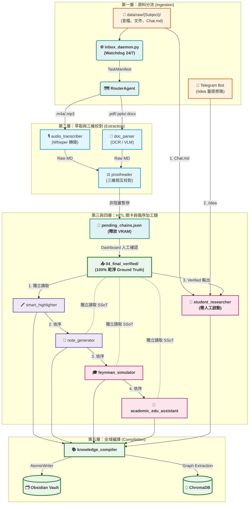

# Open Claw PKMS — 使用者手冊 (User Manual)

> **System Version**: V9.17 (Coding Guidelines Full Compliance)
> **Status**: Production-Grade Headless CLI Deployment
> **Last Updated**: 2026-05-23

---

## 快速開始 (Quick Start — TL;DR)

### 每日使用流程

```bash
# Step 1: 啟動所有服務
cd ~/Desktop/local-workspace
./infra/scripts/start.sh

# Step 2: 將檔案放入通用收件匣
cp lecture.m4a  openclaw-sandbox/data/raw/YourSubject/
cp textbook.pdf openclaw-sandbox/data/raw/YourSubject/

# Step 3: 等待自動化流程
# inbox_daemon 監測到檔案 → RouterAgent 自動分流 → 校對 → HITL Dashboard 通知
# 當 Telegram 收到通知後，前往 http://localhost:5000 確認校對結果
# 確認後，系統自動繼續後續高亮、筆記、費曼、閃卡全流程

# Step 4: 查看成果
open openclaw-sandbox/data/wiki/YourSubject/

# Step 5: 關閉服務
./infra/scripts/stop.sh
```

---

## Part 1: 系統架構全景 (V9.17 SSoT 循序處理架構)

### 全局工作流圖 (Mermaid)



### 設計理念：SSoT & Traceable

本系統嚴格遵循兩大核心理念：

1. **SSoT (Single Source of Truth)**: 所有智慧加工模組均獨立讀取 `04_final_verified/` 的同一份 Ground Truth。絕不將 LLM 產出串聯傳遞（防止格式污染與幻覺累積）。

2. **Traceable (全程可追蹤)**: `proofreader` 同時保存唯讀的 `01_raw/`（校對前）與 `04_final_verified/`（校對後），並自動生成 `correction_log.md` 修改紀錄。

---

## Part 2: 五大處理層詳解

### 第一層：資料分流門 (Ingestion)

`inbox_daemon.py` 持續監聽 `data/raw/{Subject}/`，使用穩定狀態校驗（每 5 秒檢查檔案大小，連續 3 次一致才處理）防止半程複製的檔案被搶先處理。

**RouterAgent 自動分流規則：**

| 檔案類型 | 目標 Skill | 控制方式 |
|---------|------------|---------|
| `.m4a`, `.mp3` | `audio_transcriber` | inbox_daemon 自動觸發 |
| `.pdf`, `.pptx`, `.docx`, `.xlsx` | `doc_parser` | inbox_daemon 自動觸發 |
| `*Chat*.md`, `*chat*.md` | `student_researcher` 輸入區 | **需人工手動啟動** |
| Telegram `/idea` | `student_researcher` 輸入區 | **需人工手動啟動** |

**Context-Aware 模型分流：**

| 任務複雜度 | 關鍵字 | 使用模型 |
|-----------|--------|---------|
| 低 | `auto`, `transcribe`, `parse` | `qwen3:8b` |
| 高 | `debate`, `research`, `feynman`, `analyze` | `qwen3:14b` / `deepseek-r1:8b` |

---

### 第二層：萃取與三維校對 (Extraction & Proofreading)

#### `audio_transcriber`
- **VAD 靜音預處理**：剪去長靜音，防止 Whisper 重覆字幻覺
- **單詞時間戳**：低信心度單詞標記 `[? word | timestamp ?]`

#### `doc_parser`
- **PyMuPDF 300 DPI 萃取**：精確定位多欄排版，防止 multi-column layout bleed
- **VLM 旁路優化**：若圖表 Caption 語意已充分，跳過昂貴的 VLM 解析

#### `proofreader` (三維相互校對)
- **Mode A (一對一)**：推理大模型對全稿進行語法糾錯
- **Mode B (一對多)**：段落分發給 3 個平行輕量 LLM，少數服從多數
- **Mode C (多源互助)**：若同一 Subject 同時有簡報檔與音頻，自動從簡報抽取詞彙庫校正語音轉錄

---

### 第三層：HITL 非阻塞審核 (Human-in-the-Loop Gate)

> **重要**: V9.14+ 已將舊版阻塞式 `VerificationGate` 替換為非阻塞的 Flask Dashboard 架構。

**新版 HITL 流程：**

1. `proofreader` 完成後，`RouterAgent` 將後續管線序列化至 `pending_chains.json`
2. **主程式立即退出**，釋放所有 GPU/VRAM（防止人工等待期間的記憶體浪費）
3. Telegram Bot 推送通知（附上 Dashboard 連結）
4. 用戶前往 `http://localhost:5000` 開啟 Dashboard：
   - 左側：原始音檔/文件（可播放/預覽）
   - 右側：AI 校對版本（可即時編輯）
5. 點擊 **「Save」** 或 **「Skip」**，乾淨文件寫入 `04_final_verified/{Subject}/`
6. Watchdog 自動偵測寫入，讀取 `pending_chains.json`，重新調度後續管線

---

### 第四層：循序智慧加工鏈 (Sequential Shared-SSoT Chain)

> **核心設計**：四個模組採嚴格循序執行，但每一站都**獨立讀取**同一份 `04_final_verified/` 基準真相，絕不消費前一站的 LLM 輸出。

1. 🖍️ **`smart_highlighter`**：為原文標記 `**粗體**` 與 `==高亮==`。內建防篡改錨點，原文每個字元不被刪改
2. 📝 **`note_generator`**：等高亮完成後，獨立讀取 Ground Truth，生成結構條列大綱筆記
3. 🎓 **`feynman_simulator`**：等大綱完成後，獨立讀取 Ground Truth，模擬蘇格拉底式師生對辯（本地 DeepSeek 學生 vs. 雲端 Gemini 老師）
4. 🎴 **`academic_edu_assistant`**：等費曼完成後，獨立讀取 Ground Truth，生成 SM-2 間隔重複閃卡，推送至 Anki

---

### `student_researcher` 多源漏斗 (Multi-Ingress Funnel)

> **重要**：此模組嚴格需要人工手動啟動，不參與自動化流水線。

**三個輸入源：**

```
📥 1. data/raw/ 的 Chat.md ─────────┐
                                    │
📱 2. Telegram /idea 靈感旁路 ──────┼─➔ 🧬 student_researcher
                                    │
⚖️ 3. proofreader Verified 輸出 ────┘
```

| 輸入源 | 適用對象 | 狀態 |
|--------|---------|------|
| `data/raw/` Chat.md | Gemini/Ollama 長篇 Q&A 對話備份 | 路由至輸入區，等待手動啟動 |
| Telegram `/idea` | 行動端速記靈感、語音備忘 | 寫入暫存區，等待手動啟動 |
| `proofreader` Verified 輸出 | 完整講座錄音 / 學術 PDF | 寫入原料庫，等待手動啟動 |

**啟動命令：**
```bash
cd openclaw-sandbox
uv run skills/student_researcher/scripts/run_all.py --process-all
```

**內部流程（啟動後）：**
- **Phase 0**：在 ChromaDB 做語意搜尋。有關聯 → 生成 `[[WikiLinks]]`；孤兒點子 → 加 `#incubating` 標籤，歸入 `Incubator/`
- **Phase 1**：抽取複雜學術假設論點（claims）
- **Phase 2**：`academic_library_agent` 繞過付費資料庫取得論文快照，`gemini_verifier_agent` 進行雲地 AI 三輪對辯

---

### 第五層：全域編譯與 Stub Note Mode

#### Dead-Link Guard — 樹苗筆記模式 (Stub Note Mode)

V9.16+ 改變了死鏈處理策略：

- **舊版**：若 `[[WikiLinks]]` 目標不存在，降級為純文字
- **新版**：保持 `[[WikiLinks]]` 不變，並在 `wiki/stubs/` 自動生成極簡佔位筆記（含標題、時間戳、`#stub` 標籤）

效果：Obsidian 中不再有紅字死鏈，完整保持圖譜跳轉體驗。

#### `AtomicWriter` 防崩潰寫入

所有寫入使用 `tempfile + os.replace()`，即使停電也不損壞舊筆記。

---

## Part 3: 服務啟動與停止

### 啟動所有服務

```bash
cd ~/Desktop/local-workspace
./infra/scripts/start.sh
```

啟動項目：
1. **Ollama** — 本地 LLM 推理引擎
2. **LiteLLM** — OpenAI 相容代理 (port 4000)
3. **Open WebUI** — 聊天介面 `http://localhost:3000`
4. **Inbox Daemon** — 24/7 監聽 `data/raw/` (含 RouterAgent)
5. **RAM Watchdog** — RAM 低於 15% 時節流任務
6. **HITL Dashboard** — Flask 審核儀表板 `http://localhost:5000`
7. **Telegram Bot** — 推播通知與 KB 查詢助理

### 停止服務

```bash
./infra/scripts/stop.sh
```

---

## Part 4: 手動執行各管線 (Advanced CLI)

### Audio Transcriber

```bash
cd openclaw-sandbox

# 處理所有待處理音頻
uv run skills/audio_transcriber/scripts/run_all.py --process-all

# 只處理特定科目
uv run skills/audio_transcriber/scripts/run_all.py --subject Cognitive_Psychology

# 從中斷點繼續
uv run skills/audio_transcriber/scripts/run_all.py --process-all --resume

# 強制重跑
uv run skills/audio_transcriber/scripts/run_all.py --process-all --force
```

### Doc Parser

```bash
cd openclaw-sandbox
uv run skills/doc_parser/scripts/run_all.py --process-all
uv run skills/doc_parser/scripts/run_all.py --subject AI_Papers
```

### student_researcher (需人工啟動)

```bash
cd openclaw-sandbox
# 確認 data/student_researcher/input/ 中已有待處理檔案後執行：
uv run skills/student_researcher/scripts/run_all.py --process-all
```

### Knowledge Compiler

```bash
cd openclaw-sandbox
uv run skills/knowledge_compiler/scripts/run_all.py --process-all
```

---

## Part 5: 語意快取 (Semantic Cache)

所有 `temperature=0` 的 LLM 呼叫會自動快取於：
```
openclaw-sandbox/data/llm_cache.sqlite3
```

命中時日誌顯示：
```
⚡ 命中語意快取 (Semantic Cache)，跳過推理。
```

清除快取（當 prompt 大幅修改後）：
```bash
rm openclaw-sandbox/data/llm_cache.sqlite3
```

---

## Part 6: SM-2 間隔重複 / Telegram 閃卡

`academic_edu_assistant` 自動生成 Anki 閃卡，並由 `scheduler` 在每天 09:00 推送至 Telegram。

**Telegram 操作指令：**
- `/reveal <card_id>` — 查看答案
- `/rate <card_id> <0-5>` — 評分（5=完全記住，0=完全忘記）
- SM-2 演算法根據評分自動安排下次複習日期

---

## Part 7: 檢查進度

### 即時日誌監控

```bash
tail -f openclaw-sandbox/logs/task_queue.log
```

**關鍵日誌模式：**

| 日誌訊息 | 含義 |
|---------|------|
| `▶️ [TaskQueue] 開始執行任務` | 管線已啟動 |
| `✅ [TaskQueue] 任務成功完成` | 管線完成 |
| `🔄 [TaskQueue] 準備重試 (等待 Xs)` | 指數退避重試中 |
| `☠️ [DLQ] 已隔離毒藥檔案` | 檔案失敗 3 次，移至 `data/quarantine/` |
| `⚡ 命中語意快取` | LLM 呼叫跳過推理 |
| `🗺️ [RouterAgent] 接力觸發` | Skill 之間的管線移交 |
| `📂 [Watchdog] 偵測到 verified 寫入` | HITL 確認後的自動喚醒 |
| `⛓️ [Chain] 恢復 pending_chains` | 從 pending_chains.json 復原管線 |

### Skill 狀態清單

```bash
cat openclaw-sandbox/data/audio_transcriber/state/checklist.md
cat openclaw-sandbox/data/doc_parser/state/checklist.md
cat openclaw-sandbox/data/student_researcher/state/checklist.md
```

---

## Part 8: Obsidian Vault 設定

1. 開啟 **Obsidian** → `Open folder as vault`
2. 路徑：`~/Desktop/local-workspace/openclaw-sandbox/data/wiki/`
3. 開啟 **Mermaid** 插件（用於心智圖渲染）
4. 開啟 **Dataview**（可選，用於動態查詢）

Vault 內容結構：
- YAML frontmatter（用於篩選與查詢）
- Mermaid 心智圖（視覺學習）
- `[[WikiLinks]]` 雙向連結
- `wiki/stubs/` — Stub Note 佔位檔（等待填充的知識節點）
- `wiki/Incubator/` — 待孵化的靈感筆記（`#incubating` 標籤）

---

## Part 9: 故障排除

| 問題 | 解決方案 |
|------|---------|
| 檔案未自動處理 | 確認已執行 `start.sh`；檢查 `task_queue.log` |
| LLM 超時/慢速 | 正常（大型檔案）；查看 `state/checklist.md` 確認進度 |
| `ModuleNotFoundError: No module named 'core'` | 從 `openclaw-sandbox/` 內執行，確保設定 `WORKSPACE_DIR` |
| 記憶體耗盡 / 系統凍結 | 單線程 `task_queue` 應已防止；確認 `watchdog.sh` 運行中 |
| 狀態檔損壞 | 刪除 `data/<skill>/state/` 並重跑加 `--force` |
| 檔案失敗 3 次 | 查看 `data/quarantine/<skill>/quarantine_log.json`；修復後複製回 `data/raw/` |
| HITL Dashboard 無回應 | 重啟 `python3 -m skills.proofreader.scripts.dashboard` |
| Telegram 通知未收到 | 確認 Bot Token 設定正確；查看 `logs/telegram_bot.log` |

---

## Part 10: Monorepo 目錄結構

```
local-workspace/
├── openclaw-sandbox/        ← 主應用程式
│   ├── core/
│   │   ├── ai/              ← LLM 客戶端（含 Semantic Cache）
│   │   ├── orchestration/   ← RouterAgent, TaskQueue, EventBus
│   │   ├── services/        ← inbox_daemon, scheduler, telegram_bot
│   │   └── state/           ← StateManager (atomic JSON)
│   ├── skills/              ← 各 Skill 管線
│   ├── data/                ← 執行期資料（不含於 git）
│   │   ├── raw/             ← 📥 您的輸入資料夾
│   │   ├── wiki/            ← 🧠 您的 Obsidian Vault
│   │   ├── proofreader/
│   │   │   ├── 01_raw/                ← 校對前唯讀備份
│   │   │   ├── 04_final_verified/     ← 人工確認後的 Ground Truth
│   │   │   └── pending_chains/        ← 管線暫停狀態
│   │   ├── student_researcher/input/  ← 學術研究輸入暫存區
│   │   ├── quarantine/      ← ☠️ 連續失敗 3 次的隔離檔案
│   │   └── llm_cache.sqlite3          ← ⚡ 語意快取
│   └── tests/               ← 單元測試 (pytest)
│
├── infra/
│   ├── scripts/             ← start.sh / stop.sh / watchdog.sh
│   ├── litellm/             ← LLM 代理設定 (port 4000)
│   ├── open-webui/          ← 聊天介面 (port 3000)
│   └── pipelines/           ← Pipeline 插件
│
├── docs/                    ← 全域文件（SSoT）
│   ├── ARCHITECTURE.md      ← 宏觀系統架構圖（AI agents 初始化必讀）
│   ├── USER_MANUAL.md       ← 本文件
│   ├── CODING_GUIDELINES.md ← 工程規範 v4.2.0
│   └── STRUCTURE.md         ← 完整目錄結構地圖
└── memory/                  ← AI agent 記憶層
    ├── HANDOFF.md            ← 跨 session 接力記錄
    ├── DECISIONS.md          ← 架構決策記錄 (ADR)
    ├── TASKS.md              ← 現行任務追蹤
    └── PROJECT_RULES.md      ← AI agent 協作規範
```
