# Open Claw Knowledge Ecosystem: 系統架構與資料流 (Architecture & Data Flow)

本文件定義了 Open Claw 生態系中各個技能 (Skills) 之間的關聯，以及資料目錄的嚴格流向。為了確保自動化管線順暢運作，所有開發者與使用者都必須遵守此架構。

## 1. 核心資料夾定義

系統的檔案交換完全依賴 `data/` 目錄。我們區分了三層資料夾，每一層都有明確的功能與權限：

### 📥 1.1 `data/raw/` (大一統收件匣 / Universal Inbox)
*   **角色**：唯一的「人類/外部輸入點」。
*   **規則**：不管是手動複製檔案、透過 Telegram 傳送、或是從 Web 上傳的未處理原始檔（如 `.pdf`, `.m4a`），**全部都統一放進這裡**。
*   **科目層級**：在 `data/raw/` 內建立以「科目名稱」命名的子資料夾（例如 `data/raw/認知心理學/`），`inbox_daemon` 會自動保留此層級。
*   **PDF 智慧分流**：`inbox_daemon` 會根據 `core/inbox_config.json` 內定義的規則判斷 PDF 路由模式：`audio_ref`（僅供語音校對）、`doc_parser`（獨立解析）、`both`（同時執行兩者）。
*   **後續處理**：`core/inbox_daemon.py` 會 24 小時監控這個資料夾，發現新檔案後自動分發。

### ⚙️ 1.2 `data/<skill>/input/` (技能緩衝區 / Skill Buffer)
*   **角色**：機器專用的待辦事項區。
*   **規則**：**人類請勿手動放入檔案至此**。這是 `inbox_daemon.py` 處理後存放的地方，或是作為不同階段腳本之間傳遞資料的緩衝區。
*   **例外**：某些基於 RAG 動態生成的技能（例如 `academic-edu-assistant`）不依賴 `input/`，而是直接從資料庫檢索。

### 📦 1.3 `data/<skill>/output/` (技能產出區 / Skill Output)
*   **角色**：個別技能執行完各個 Phase 之後的產出物。
*   **規則**：每個 Phase 都會產生對應的子資料夾（如 `01_transcript`, `02_proofread` 等）。這是供中途檢查或除錯使用的中繼產出，不是最終的知識庫。

### 🧠 1.4 `data/wiki/` (展示區 / The Storefront / Obsidian Vault)
*   **角色**：知識的最終歸宿，也就是你可以用 Obsidian 開啟的 Vault。
*   **規則**：`knowledge-compiler` 技能會掃描各大「工廠」的最終產出，建立 `[[雙向連結]]` 後，將最精華的 Markdown 筆記發布到這裡。這也是所有「二次加工技能 (Secondary Skills)」的資料來源。
*   **RAG 來源**：`telegram-kb-agent` 的向量資料庫完全基於 `data/wiki/` 來建立索引。

---

## 2. 技能生態系總覽 (Skill Ecosystem)

目前系統中有 **8 個核心技能**，它們互相串聯形成一套完整的知識生產線：

```mermaid
graph TD
    A[Human / Telegram] -->|Upload .pdf / .m4a| B(data/raw/Subject/)
    B -->|inbox_daemon.py&#10;audio_ref| C(Audio Transcriber)
    B -->|inbox_daemon.py&#10;doc_parser| D(Doc Parser)
    B -->|inbox_daemon.py&#10;both = copy to both| C
    B -->|inbox_daemon.py&#10;both = move to both| D

    C -->|output/05_synthesis/| E[Knowledge Compiler]
    D -->|output/03_synthesis/| E

    E -->|Publish| F[(data/wiki/)]

    F <-->|Obsidian| G[Human Read & Edit]

    F -->|Read| H(Interactive Reader / Note Generator / Smart Highlighter)
    H -->|Write Back / Overwrite| F

    F -->|Indexer| I[(ChromaDB)]
    I -->|RAG| J(Telegram KB Agent)
    I -->|RAG Compare| K(Academic Edu Assistant)

    J -->|Answer| L[Telegram / Open Claw]
    K -->|Compare Report & Anki CSV| L
```

## 3. 各技能的 Input / Output 關係對照表

| 技能 (Skill) | 角色 | Input 來源 | Output 去向 | 說明 |
| :--- | :--- | :--- | :--- | :--- |
| **audio-transcriber** | 工廠 | `data/raw/Subject/` 轉送至 `input/Subject/` | `output/05_notion_synthesis/Subject/` | 將語音轉成結構化筆記 |
| **doc-parser** | 工廠 | `data/raw/Subject/` 轉送至 `input/Subject/` | `output/03_synthesis/Subject/` | 將 PDF 轉成結構化筆記 |
| **knowledge-compiler** | 物流 | 屃描上述工廠的最終 `output` | `data/wiki/` | 建立雙向連結並上架至展示區 |
| **note-generator** | 學者 | `data/wiki/` | `data/wiki/` | 二次加工：讀取展示區筆記並生成總結筆記 |
| **smart-highlighter** | 學者 | `data/wiki/` | `data/wiki/` | 二次加工：讀取展示區筆記並原地標記重點 |
| **interactive-reader** | 學者 | `data/wiki/` | `data/wiki/` | 原地覆寫解析 Markdown 內的 `> [AI:]` 標籤 |
| **telegram-kb-agent** | 客服 | `data/wiki/` (建索引) | RAG 文字回覆 | 透過 ChromaDB 提供行動端問答 |
| **academic-edu-assistant** | 學者 | ChromaDB 向量庫 | `output/01_comparison/` & `02_anki/` | 動態跨檔案比較並產生 Anki 卡片 |
| **inbox-manager** | 工具 | `core/inbox_config.json` | 終端機輸出 | 查詢/新增/刪除 PDF 路由規則 |

## 4. 關於 Open Claw 與 Telegram 的整合

本生態系被設計為 Open Claw 的「模組化工具 (Native Skills)」。
當使用者透過 Telegram 傳送訊息時：
1. 訊息由 **Open Claw 主程式 (Node.js)** 接收。
2. Open Claw 的核心 LLM 判斷意圖。
3. 如果是知識查詢，Open Claw 會調用 CLI `python skills/telegram-kb-agent/scripts/run_all.py --query "問題"`。
4. 如果是比較分析，Open Claw 會調用 CLI `python skills/academic-edu-assistant/scripts/run_all.py --query "比較..."`。
5. Python 腳本將結果 `print()` 至標準輸出，由 Open Claw 原路返回 Telegram。

**此設計確保了 Telegram Bot Token 只有單一實例在運行（即 Open Claw 主程式），避免了 Long Polling 衝突。**
