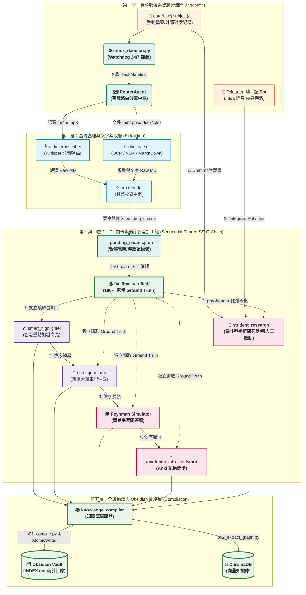

# OpenClaw V9.21 智慧循序資料處理工作流 (SSoT & Traceable)

本文件為 `openclaw-sandbox` 內部的系統架構與模組設計指南。整個系統以 **單一真理源 (Single Source of Truth, SSoT)** 與 **全程可追蹤 (Traceable)** 為核心理念，重構為防過載且穩健的 **5層雙軌雙向處理工作流**。此版本(Phase 6)全面導入了 Editable Install (`uv pip install -e .`) 模組解析，以及 `FileStabilityPoller` 防抖與 `llm_session` VRAM 安全機制。

---

## 🏛️ 5層智慧循序架構與「多源匯聚」路由圖 (Mermaid Flowchart)



---

## 💎 兩大核心設計理念 (Core Principles)

### 1. 🏛️ 單一真理源 (Single Source of Truth, SSoT)
* **極致防污染設計**：所有影音、文件經 Layer 2 處理後，必須透過 `proofreader` 產生 **唯一、100% 乾淨且經人工確認的基準真相檔 (`04_final_verified/`)**。
* **循序獨立消費機制 (Sequential Shared-SSoT Chain)**：為防範多模組並行造成的 GPU/VRAM 瞬間過載 (OOM) 且確保低資源消耗，智慧加工模組（`smart_highlighter` ➔ `note_generator` ➔ `feynman_simulator` ➔ `academic_edu_assistant`）採**循序串簽式執行**。然而，**核心之處在於：每一站均是獨立讀取 `04_final_verified/` 的同一個基準真相檔**，而非將前一站的 LLM 產出傳遞給下一站（嚴禁串聯加工污染），從根本上杜絕了格式二次污染與幻覺累積，完美貫徹 SSoT 精神。
* **統一出口**：所有編譯產出最終由 `knowledge_compiler` 統一彙整至單一 `Obsidian Vault` 與向量 `ChromaDB`，實現資料的完全一致性。

### 2. 🔍 全程可追蹤與重新校對 (Traceable & Re-triggerable)
* **物理雙版本備份**：`proofreader` 會同時永久保存 **「校對前原始版」(`01_raw/`)** 與 **「校對後最終版」(`04_final_verified/`)**。原始版唯讀，作為版本對比的黃金基準。
* **增量變更記錄**：自動產生 `correction_log.md` 修改對照誌，利用 Diff 機制完整記錄每次人工微調。
* **一鍵重校與管線重算 (Re-triggerable Flow)**：若未來需要重新校對，只需在 Web Dashboard 重新讀取該檔的 `01_raw/` 進行修改並儲存，系統會覆寫 `04_final_verified/`。Watchdog 將**自動異步重新觸發後續所有 Layer 3~Layer 5 的循序管線與編譯**，實現 100% 的可追蹤與無痛復原。

---

## 🧬 student_research 多源漏斗路由機制 (Multi-Ingress Funnel)

`student_research` 作為系統中最深度的學術研究大腦，採用先進的 **「多源漏斗匯聚 (Multi-Ingress Funnel)」** 架構。它接收三個高度互補的輸入流，突破線性處理的繁瑣瓶頸，讓碎片化的點子、外部對話與正規文檔無縫交叉：

```
  📥 1. data/raw/ 的 Chat.md (外部聊天對話檔) ─────┐
                                                   │
  📱 2. Telegram /idea 遠程靈感旁路 (隨手記) ───────┼─➔ 🧬 【 student_research 】
                                                   │
  ⚖️ 3. proofreader 乾淨的 Verified 輸出 ──────────┘
```

1. **Chat Markdown 對話紀錄**：使用者手動放入 `data/raw/` 的 Gemini/Ollama 高質量 Q&A 對話備份。因使用者多在行動端使用速記或重點式備註，需回到電腦前進行深度確認，**故此類檔案會被自動分流路由至學術輸入存儲區，嚴格靜待人工作業「手動觸發」以防資源浪費**。
2. **Telegram Bot `/idea` 旁路**：行動端隨手記錄的語音或靈感。此旁路繞過 Layer 2/3 耗時的常規處理，**直接寫入學術漏斗暫存區，靜待使用者回到電腦前進行深度加工，並手動觸發執行**。
3. **Proofreader Verified 輸出**：經過人機協同校對、100% 乾淨的講座錄音或學術 PDF，作為深度論文檢索與學術對辯的黃金素材，**亦會寫入學術原料庫，靜待手動點擊觸發執行**。

---

## 🏃‍♂️ OpenClaw 5層工作流詳細內在運作 (Detailed Inner Operations)

### 📥 第一層：資料收發與智慧分流門 (Ingestion & Routing)
* **`inbox_daemon.py` (Watchdog 24/7 監聽)**：
  - **穩定狀態校驗 (Stable-State Heuristics)**：為防大型音檔或 PDF 還在拷貝或下載時就被搶先處理，監聽程式會每隔 5 秒檢查檔案大小，必須連續 3 次檢查大小完全一致，才認定檔案穩定並啟動工作流。
  - **TaskManifest 封裝**：為每個穩定檔案產生唯一 UUID，封裝檔案路徑、科目 (Subject)、時間戳與 Hash，傳遞至路由中樞。
* **`router_agent.py` (智慧路由中樞)**：
  - **動態意圖路由**：解析 `inbox_config.json` 規則，根據副檔名與標籤決定流向（`.m4a`/`.mp3` 送 `audio_transcriber`；`.pdf` 送 `doc_parser`；`Chat.md` 則直接分流至 `student_research`）。
  - **Context-Aware 智慧模型分流**：路由大腦會評估任務複雜度。高難度、需深度推理的任務（如 claims 查證）會分發給 `qwen3:14b` 或 `deepseek-r1:8b` 等推理大模型；常規分流則使用輕量的 `qwen3:8b`。

### 📄 第二層：高精文字萃取與多源相互輔助校對層 (Extraction & Proofreading)
* **`audio_transcriber` (Whisper 單詞時間戳轉錄)**：
  - **VAD 靜音預處理**：使用語音活動檢測 (VAD) 剪去長靜音，杜絕 Whisper 的重覆字幻覺與死循環。
  - **單詞微秒時間戳**：為每個單詞標記精確時間。低信心度單詞自動標記 `[? word | timestamp ?]`，供後續校對追蹤。
* **`doc_parser` (OCR 與多模態視覺分離)**：
  - **PyMuPDF 300 DPI 萃取與多欄防溢**：精確定位多欄式排版，避免把跨欄文字橫向讀錯（預防 multi-column layout bleed）。
  - **VLM 旁路優化**：如果圖表周邊的文字標題（Caption）已具備高語意對齊，則自動繞過昂貴的 Vision-Language-Model (VLM) 解析以節省 API 消耗。
* **`proofreader` (三維相互輔助校對 consensus & 多源校對)**：
  - **Mode A (一對一深文糾錯)**：利用大語言模型對全稿進行流暢度與語法糾錯。
  - **Mode B (一對多共識投票)**：切分段落並發送給三個平行輕量 LLM，以少數服從多數原則過濾模型幻覺字。
  - **Mode C (多源詞彙相互校對 Many-to-1 Calibration)**：若同一個 Subject 下同時存在簡報檔（如 `Lecture1_slides.pdf`）與語音備忘錄，`proofreader` 會**自動讀取簡報中的專業名詞與公式庫**，去校正語音轉錄中同音字、專有名詞的拼寫錯誤，讓校對精準度實現維度級提升！

### ⚖️ 第三與四層：人機協同審核關口與循序智慧加工鏈 (HITL Gate & Sequential Processing Matrix)
* **非阻塞管線暫停 (Ephemere Dashboard)**：
  - **`pending_chains.json` 狀態保存**：當 Layer 2 結束後，`RouterAgent` 會將後續 pipeline（高亮、大綱、費曼、閃卡）暫存至 `pending_chains/{Subject}/{file_id}.json`。
  - **記憶體釋放防 OOM**：系統主程序立即安全退出，並向 Ollama 發送指令卸載所有 GPU 顯存/VRAM 模型，防止人機協同等待期間造成的硬體資源浪費。
  - **Flask Web 儀表板**：使用者在此處一邊聽音檔一邊校正。微調完成後點擊 "Save" 或 "Skip" 儲存。
* **動態喚醒與循序重算機制**：
  - 當儲存行為將乾淨檔案寫入 `04_final_verified/{Subject}/` 時，Watchdog 自動感知寫入，讀取 `pending_chains.json` 復原 TaskManifest，重新分配顯存並以**循序加工鏈模式**調度 downstream 管線（依序執行高亮、大綱、費曼與閃卡），徹底避免 16 GB Apple Silicon 等硬體環境下因並行產生的 VRAM 瞬間耗盡 (OOM) 隱憂。
  - **智慧加工模組循序運作流程**：
    - 🖍️ **`smart_highlighter` (第一站)**：獨立讀取 Ground Truth 為原文標記 `**粗體**` 與 `==高亮==`。內建 **防篡改正則錨點 (Anti-Tampering guard)**，保證原文每個字元絕對不被 LLM 刪改或無端增減。
    - 📝 **`note_generator` (第二站)**：待高亮結束後自動啟動，同樣獨立讀取同一份 Ground Truth 基準，提煉為結構清晰的條列式大綱筆記。
    - 🎓 **`feynman_simulator` (第三站)**：待大綱生成結束後啟動，同樣獨立讀取同一份 Ground Truth 基準，模擬 Socratic (蘇格拉底式) 師生辯論。由本地大模型扮演打破砂鍋問到底的學生，向由雲端大模型扮演的導師進行觀念問答，極大化增強使用者的概念理解深度。
    - 🎴 **`academic_edu_assistant` (第四站)**：待費曼結束後自動啟動，同樣獨立讀取同一份 Ground Truth 基準，自動從中抽取核心問答與對照，以 SM-2 Spaced Repetition (間隔重複) 演算法產生優質記憶閃卡，並在通過 HITL 關卡後自動推送到您的 Anki 中。

* **🧬 `student_research` (深度學術漏斗 - 獨立手動啟動)**：
  - **嚴格手動啟動機制**：鑑於學術研究之嚴謹性，且使用者在行動端常先以「速記法」或「重點式備忘」做初步記錄，本模組**不**參與上述自動流水線。即使 data/raw/ 中存在對話 md 檔案，該模組 inputs 亦僅會暫存在漏斗 ingress 區。使用者必須回到電腦前手動啟動它，以進行最深度的學術查證與交叉檢索，避免背景自動執行浪費 API token。
  - **Phase 0 (語意嫁接與靈感孵化)**：在 ChromaDB 做語意關聯性搜尋。若有高關聯筆記，自動生成 `[[WikiLinks]]` 將新舊知識在 Obsidian 中融合；若為無關聯的點子，則打上 `#incubating` 標籤，歸入 **`Incubator` (靈感孵化器)** 目錄。
  - **Phase 1 (待證論點提取)**：若內容包含複雜學術假設，自動抽取 claims。
  - **Phase 2 (Playwright 免密資料檢索 & AI 辯證)**：
    - **`academic_library_agent`**：操作 Playwright 模擬真實瀏覽器行為，繞過付費論文網站（Elsevier、Wiley、ScienceDirect）與 Google Gemini Web 的登入牆，下載乾淨的 PDF/Text 快照。
    - **`gemini_verifier_agent`**：調用雲端 GPT/Gemini 與本地 `deepseek-r1:8b` 進行三輪邏輯對辯，產出證據確鑿的學術查證補充包（Verification Report）。

### 📚 第五層：全域編譯、死鏈守衛與 Obsidian 入庫層 (Compilation & Vault Egress)
* **`knowledge_compiler` (物理入庫守門人)**：
  - **死鏈守衛 (Dead-Link Guard) - 樹苗筆記模式 (Stub Note Mode)**：在彙整編譯產出時，自動掃描所有雙向連結 `[[WikiLinks]]`。若目標關聯筆記在硬碟上尚未創建，系統**不再**將其降級為純文字（以防破壞 Obsidian 的導航跳轉體驗），而是保持 `[[WikiLinks]]` 不變，並自動在 `wiki/stubs/` 目錄下生成極簡的「樹苗筆記 (Stub Note)」佔位檔。這些佔位檔（例如 `Title.md`）僅包含標題 Header、建立時間戳記與 `#stub` 標籤，讓 Obsidian 維持完整的跳轉與雙向鏈接圖譜，同時消除紅字死鏈，提供完美的筆記漫遊體驗。
  - **物理安全原子寫入 (`AtomicWriter`)**：寫入過程極其嚴格，採用 `tempfile.NamedTemporaryFile` 在同磁區進行臨時寫入，確保成功後才以 `os.replace()` 原子式覆寫。即使在寫入的微秒瞬間發生停電或當機，也絕不損壞舊有筆記。
  - **總目錄重構**：更新 Subject 下 graves 的 `INDEX.md` 索引總目錄，維護學術脈絡。
  - **圖譜抽取與 RAG 同步**：從筆記中抽取 Entity 與 Relation 三元組寫入 ChromaDB 與 Graph DB。完成後，您便可隨時透過手機 Telegram KB 助理，利用 RAG 技術對您的專屬大腦提問！

---

## 🛠️ 開發與驗證命令 (Ops Commands)

為確保 V9.17 修改後之 Markdown 語法、Python 檔案與 Pydantic 類型符合最高標準，本專案設有嚴格之 monorepo 品質守衛門。在完成任何檔案異動後，必須在 monorepo 根目錄執行驗證命令：

```bash
cd /Users/limchinkun/Desktop/local-workspace
./ops/check.sh
```

本腳本將會自動掃描：
1. **Markdown 格式與死鏈**：確認所有 file links 是否健全。
2. **Import 隔離度**：確保 `core/` 下的所有 domain sub-packages (`ai/`, `orchestration/`, `services/`, `utils/`, `state/`) 正確被導入。
3. **Mypy 與 Ruff**：確保型別檢查與語法風格無虞。
